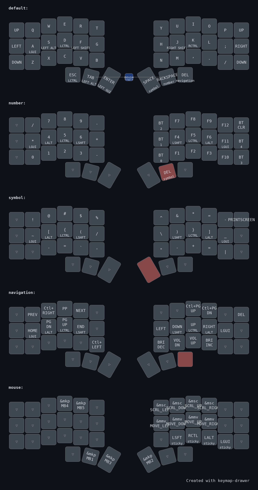

# Typeractive Corne ZMK Configuration

This repository contains the ZMK configuration for a Corne split keyboard with custom keymaps.

## Keyboard Layout



## Features

- **Split Keyboard Design**: Ergonomic Corne layout with two halves
- **Multiple Layers**:
  - Default Layer: Main typing keys with intuitive layout
  - Number Layer: Numeric input and function keys
  - Symbol Layer: Special characters and symbols
  - Navigation Layer: Movement, media controls, and screen navigation
  - Mouse Layer: Mouse movement and button controls

## Layer Details

### Default Layer
```
,-------------------------------------.     ,-------------------------------------.
| UP    |  Q  |  W  |  E  |  R  |  T  |     |  Y  |  U   |  I  |  O  |  P  | UP   |
|-------+-----+-----+-----+-----+-----|     |-----+------+-----+-----+-----+------|
| LEFT  |  A  |  S  |  D  |  F  |  G  |     |  H  |  J   |  K  |  L  |  ;  | RIGHT|
|-------+-----+-----+-----+-----+-----|     |-----+------+-----+-----+-----+------|
| DOWN  |  Z  |  X  |  C  |  V  |  B  |     |  N  |  M   |  ,  |  .  |  /  | DOWN |
`-------------------+-----+-----+-----|     |-----+------+------------------------'
                   | ESC | TAB | ENT |     | SPC | BKSP | DEL |
                   `-----+-----+-----'     `-----+------+-----'
```

### Number Layer
```
,------------------------------------.     ,-------------------------------------.
|      |  /  |  7  |  8  |  9  |  .  |     | BT2 |  F7  |  F8 |  F9 | F12 |BT CLR|
|------+-----+-----+-----+-----+-----|     |-----+------+-----+-----+-----+------|
|      |  *  |  4  |  5  |  6  |  +  |     | BT1 |  F4  |  F5 |  F6 | F11 | BT4  |
|------+-----+-----+-----+-----+-----|     |-----+------+-----+-----+-----+------|
|      |  0  |  1  |  2  |  3  |  -  |     | BT0 |  F1  |  F2 |  F3 | F10 | BT3  |
`------------------+-----+-----+-----|     |-----+------+------------------------'
                   |     |     |     |     |     |  DEL |     |
                   `-----+-----+-----'     `-----+------+-----'
```

### Symbol Layer
```
,------------------------------------.     ,-------------------------------------.
|      |  !  |  @  |  #  |  $  |  %  |     |  ^  |  &   |  *  |  =  |  -  | PRSCR|
|------+-----+-----+-----+-----+-----|     |-----+------+-----+-----+-----+------|
|      |  ~  |  [  |  {  |  (  |  /  |     |  \  |  )   |  }  |  ]  |  _  |      |
|------+-----+-----+-----+-----+-----|     |-----+------+-----+-----+-----+------|
|      |     |  -  |  =  |  `  |  '  |     |  "  |  -   |  +  |  =  |  |  |      |
`------------------+-----+-----+-----|     |-----+------+------------------------'
                   |     |     |     |     |     |      |     |
                   `-----+-----+-----'     `-----+------+-----'
```

### Navigation Layer
```
,------------------------------------.     ,-------------------------------------.
|      | PREV|L→TAB| P/P |NEXT |     |     |     |      | PGU | PGD |     | DEL  |
|------+-----+-----+-----+-----+-----|     |-----+------+-----+-----+-----+------|
|      |HOME |PGDN |PGUP |END  |     |     | ←   |  ↓   |  ↑  |  →  | GUI |      |
|------+-----+-----+-----+-----+-----|     |-----+------+-----+-----+-----+------|
|      |     |     |     |     |L←TAB|     |BRI- |VOL-  |VOL+ |BRI+ |     |      |
`------------------+-----+-----+-----|     |-----+------+------------------------'
                   |     |     |     |     |     |      |     |
                   `-----+-----+-----'     `-----+------+-----'
```

### Mouse Layer
```
,------------------------------------.     ,-------------------------------------.
|      |     |     | MB4 | MB5 |     |     |WHL← |WHL↓  |WHL↑ |WHL→ |     |      |
|------+-----+-----+-----+-----+-----|     |-----+------+-----+-----+-----+------|
|      |     |     |     |     |     |     |MS ← |MS ↓  |MS ↑ |MS → |     |      |
|------+-----+-----+-----+-----+-----|     |-----+------+-----+-----+-----+------|
|      |     |     |     |     |     |     |     |LSHFT |RCTRL|LALT |LGUI |      |
`------------------+-----+-----+-----|     |-----+------+------------------------'
                   |     | MB1 | MB3 |     | MB2 |      |     |
                   `-----+-----+-----'     `-----+------+-----'
```

## Mouse Configuration

The mouse configuration provides customized settings for mouse movement speed and acceleration. The mouse layer allows for:

- Mouse cursor movement (left, right, up, down)
- Mouse wheel scrolling (horizontal and vertical)
- Mouse buttons (primary, secondary, middle, back, forward)
- Modifier keys while using mouse

## Bluetooth Support

The keyboard supports Bluetooth connections to multiple devices with easy switching between profiles.

## Setup

To customize this configuration:
1. Fork this repository
2. Make changes to the keymap or configuration files
3. Build using ZMK's GitHub Actions
4. Flash the resulting firmware to your Corne keyboard
